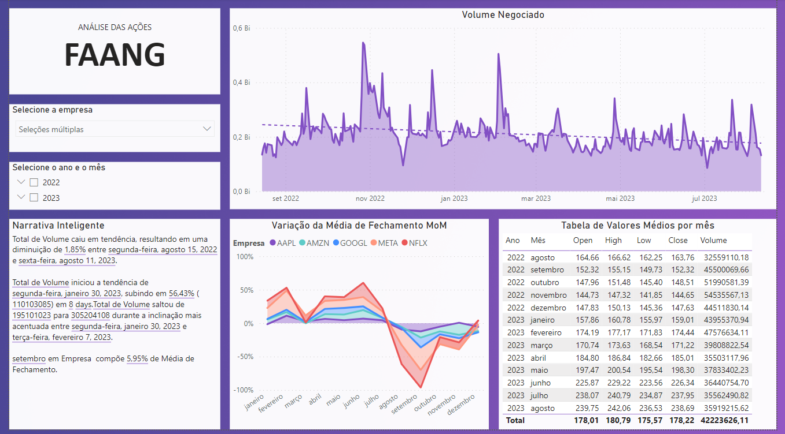

# Dashboard Ações FAANG
 

  

 

## Sobre o projeto
Nesse dashboard foram utilizados dados reais, disponíveis publicamente pelo site da NASDAQ, com o  objetivo de analisar dados das ações FAANG no último ano (ago/22 - ago/23). Esse acrônimo é utilizado para referenciar as 5 maiores empresas de tecnologia: Facebook (que atualmente é Meta), Apple, Amazon, Netflix e Google.
 

  

 

Como se tratam de dados em série temporal, foi utilizado um recurso específico do Power BI para analisar esse tipo de problema, denominado _Time Intelligence_. Também foram utilizados os recursos de Narrativa Inteligente, segmentação (por mês, ano e ação) e linha de tendência, para atender os objetivos listados abaixo.

* Qual o total de volume negociado de açõesao longo do tempo para as 5 empresas que  estão  sendo  analisadas? Essa  análise  deverá ser feita para uma  única empresa ou combinação de empresas.
* Qual  o  valor  médio  de  abertura  (Open),  mais  alto  (High),  mais  baixo  (Low)  e  de fechamento (Close) das ações de todas as empresas para todos os meses do período de  dados  analisado? Mostrar  no  formato  de  tabela  e permitir  que  essa  análise  seja  feita  para  uma  única  empresa  ou  combinação  de empresas.
* Qual  a  variação  da  média  do  valor  de fechamento  (close)  das  ações  de  todas  as empresas  ao  longo  do  tempo,  mês  a  mês?  Permitir  que  essa  análise  seja  feita  para uma única empresa ou combinação de empresas.
 

* **[Projeto na íntegra (disponível para download)](https://github.com/raffaloffredo/dashboard_acoes_faang/blob/main/dashboard_faang.pbix)**
 

## Material Extra
Os dados utilizados nesse projeto referem-se às  e também estão disponíveis para download.

* **[Dados FAANG](https://github.com/raffaloffredo/dashboard_acoes_faang/blob/main/dados_faang.csv)**
 

## Outros projetos

* **[Dashboard Financeiro](https://github.com/raffaloffredo/dashboard_financeiro)**
* **[Dashboard Logístico](https://github.com/raffaloffredo/dashboard_logistica)**
* **[Dashboard de Marketing](https://github.com/raffaloffredo/dashboard_marketing)**
* **[Dashboard de Vendas](https://github.com/raffaloffredo/dashboard_vendas)**
* **[Dashboard Contabilidade](https://github.com/raffaloffredo/dashboard_contabilidade)**
* **[Dashboard de Vendas Globais](https://github.com/raffaloffredo/dashboard_vendas_globais/)**
* **[Airbnb New York](https://github.com/raffaloffredo/airbnb_new_york_portuguese)**
* **[Estudo atualizado sobre COVID-19 no Brasil e no mundo](https://github.com/raffaloffredo/covid_2023_portuguese)**
* **[Detecção de fraude em cartão de crédito](https://github.com/raffaloffredo/fraud_detection_portuguese)**
* **[Previsão de Churn](https://github.com/raffaloffredo/churn_prediction_portuguese)**
 

 ## Contatos

  
  
  
  

